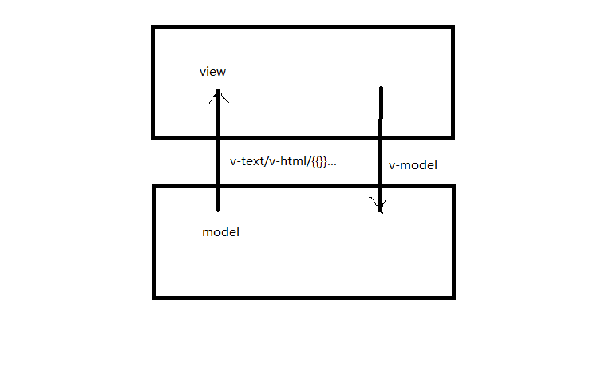

# Vue

|jQuery|Vue|
|-|-|
|操作节点|操作数据|
|节点驱动|数据驱动|
|库|框架|
|老|新|
|$,jQuery|Vue|

# 安装
1.在html中，引入vue框架
```js
<script src="../js/vue.js"></script>
```

2.实例化Vue,并绑定id属性,让Vue控制此区域，并提供对应的数据
```js
var demo = new Vue({
	//获取区域
	el: "#demo",
	//为该区域提供数据
	data: {
		name: "广州",
		color: "p"
	}
})
```
3.使用表达式{{}}来决定我在那个视图区域展示对应的内容

**展示各种数据类型**
```html
<p style="color: red;">1.字符串</p>
<p>{{html}}</p>
<p>{{html}}</p>
<p>{{html}}</p>

<p style="color: red;">2.对象</p>
<p>{{obj.name}}</p>
<p>{{obj.skill}}</p>

<p style="color: red;">3.数组</p>
<p>{{arr}}</p>
<p>{{arr[0]}}</p>
<p>{{arr[1]}}</p>
<p>{{arr[2]}}</p>

<p style="color: red;">4.数字</p>
<p>{{num+1/4}}</p>
<p style="color: red;">5.布尔值</p>
<p>{{!bool?"真的":"假的"}}</p>
```

**绑定的地方**
```html
绑定属性值
<p :id="color">id</p>
绑定文本值
<p>{{color}}</p>
```

**使用算数运算符**
```html
<p>{{!num}}</p>
<p>{{num+123321}}</p>
<p>{{num?1:2}}</p>
```

# 指令
## v-text
```
v-text vs {{}}
```
区别在于如果vue是先引入的话`{{name}}-->name`
- v-text用在vue后引入
- {{}}用在vue先引入

## v-if

v-if接受一个布尔值，如果为真那就显示，如果为假那就隐藏
v-if增加节点或者删除节点
```html
<p v-if="!bool">1.显示或者隐藏这一块</p>
<p v-else>2.显示或者隐藏这一块</p>
```

## v-show
v-show就是控制css的display的属性值在block和none之间切换
```html
<p v-show="bool">显示或者隐藏</p>
```

## v-for
用在渲染同一个标签,，它可以嵌套v-for本身，也可以嵌套v-if和v-show

```html
<li v-for="a in arr" v-if="a.bool">
	<p v-if="a.name=='广州'">{{a.name}}</p>
	<p v-for="aa in a.skill">{{aa}}</p>
</li>
```

## v-html

配合富文本编辑器使用，动态渲染html代码
```html
<div>{{html}}</div>
```

## v-model



双项数据绑定

input,select,textarea
```html
<p style="color:red">1.input</p>
<input v-model="name" />
<input v-model="num" type="range" />
```

## v-bind:xxx

:id == v-bind:id
:style == v-bind:style
```html
<p v-bind:style="{color:'red',fontSize:'50px'}">red</p>
<p :style="{color:'red',fontSize:'50px'}">red</p>
```
